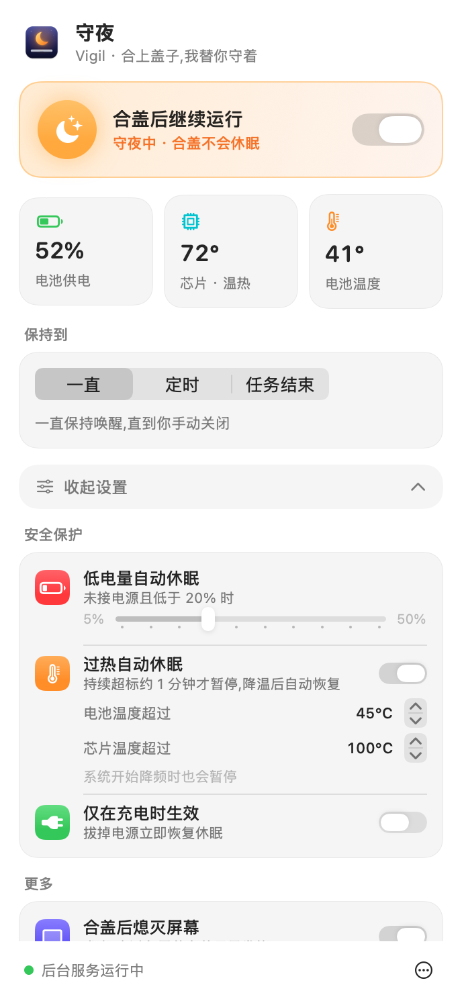

<p align="center">
  
</p>

<h1 align="center">守夜 Vigil</h1>

<p align="center">
  <b>合上盖子,我替你守着。</b><br>
  让 MacBook 合盖后继续运行的菜单栏小工具——带低电量保护和过热暂停,<br>
  专为让 Claude Code、Codex 这类 AI 编程助手通宵干活而做。
</p>

<p align="center">
  
  
  
  
</p>

<p align="center">
  
  &nbsp;&nbsp;
  
</p>

---

## 为什么需要它

macOS 合上盖子就会休眠,跑到一半的任务直接暂停。系统自带的 `caffeinate`、以及 KeepingYouAwake 这类工具**都拦不住合盖休眠**——合盖是硬件触发的,只有 `SleepDisabled` 这个系统标志位能压住它。

但直接开这个标志位很危险:电量耗尽强制关机、塞进包里闷到发烫,都没人管。

**守夜**把这件事做成了一个安全的开关。

## 功能

| | |
|---|---|
| 🌙 **合盖继续运行** | 无需外接显示器,电池供电也能用 |
| 🤖 **任务结束自动休眠** | 盯着 Claude Code / Codex,AI 空闲几分钟后自动恢复休眠,不用守到半夜手动关 |
| ⏱️ **定时关闭** | 30 分钟到 8 小时,面板显示倒计时 |
| 🌡️ **真实温度保护** | 直接读取芯片与电池传感器;电池超过 45°C、芯片超过 100°C 或系统开始降频,持续约 1 分钟即暂停,降温后自动恢复 |
| 🔋 **低电量自动休眠** | 未接电源且电量低于阈值(5%–50% 可调) |
| 🖥️ **合盖熄灭屏幕** | 解决合盖后屏幕背光仍亮着、白白耗电发热的问题 |
| 🧯 **冲突检测** | 发现 UU远程、Amphetamine 等软件在改回休眠设置时,点名提醒 |
| 🔔 **通知** | 过热、低电量暂停,或 AI 任务完成时发系统通知 |
| 🔌 **仅充电时生效 / 插电自动开启** | |
| 🇨🇳 **中文原生界面** | SwiftUI 编写,浅色 / 深色自动适配,守夜中菜单栏图标变为琥珀色 |

### 温度阈值为什么这样设

| 传感器 | 默认上限 | 理由 |
|---|---|---|
| 电池 | **45°C** | 锂电池长期高于 40°C 老化明显加快,合盖后电池散热最差,是最需要保护的部件 |
| 芯片 | **100°C** | Apple Silicon 设计上可以在 95–105°C 工作,无风扇的 MacBook Air 编译时常到 95°C 以上,会自己降频保护,设太低会频繁误停任务 |
| 系统降频 | 等级「偏热」 | 来自 macOS 自己的热压力判断,比任何单一温度都可靠 |

短暂的尖峰不会触发,需要连续约 1 分钟超标;暂停后需降温 3°C 才恢复,避免反复开关。

## 安装

**不需要终端,不需要开发工具。**

1. 下载最新版 [**Vigil.dmg**](https://github.com/mqm08/vigil-lid-awake/releases/latest/download/Vigil.dmg)
2. 双击打开,把 **守夜** 拖进「应用程序」
3. 打开守夜,菜单栏会出现 🌙,点开面板,点 **「一键安装」**
4. 系统会弹出密码框,输入开机密码即可

之后所有操作都在面板里完成,不再需要密码。守夜中,菜单栏图标会变成**琥珀色的星月**。

<details>
<summary><b>打开时提示「无法验证开发者」怎么办?</b></summary>

守夜是免费开源项目,没有购买苹果开发者证书,所以首次打开会被系统拦截。二选一:

- 打开 **系统设置 → 隐私与安全性**,滚到底部,找到守夜,点 **「仍要打开」**
- 或在终端运行:
  ```bash
  xattr -dr com.apple.quarantine /Applications/Vigil.app
  ```

源码全部公开,可以自行审阅或从源码构建。
</details>

<details>
<summary><b>从源码安装(开发者)</b></summary>

需要 Xcode Command Line Tools(`xcode-select --install`)。

```bash
git clone https://github.com/mqm08/vigil-lid-awake.git
cd vigil-lid-awake
sudo ./install.sh
```
</details>

## 卸载

面板右下角 **⋯ → 卸载守夜**,会移除后台服务、设置和应用本身,休眠行为恢复为系统默认。

从源码安装的也可以用 `sudo ./uninstall.sh`。

## 常见问题

**守夜时断时续,面板提示「XXX 在改回休眠设置」?**
有些软件会定期重写系统休眠设置,和守夜互相覆盖,合盖时可能因此突然休眠。已知的有:

- **UU远程**:每 10 分钟重写一次。在 UU远程 设置里关闭「防止休眠」,或使用守夜时退出 UU远程
- **Amphetamine、Lidless、KeepingYouAwake、Sleepless**:同类工具,二选一即可

**「任务结束」模式怎么判断 AI 在干活?**
看 `claude` / `codex` 进程以及它们启动的所有子进程(编译、测试、脚本)的 CPU 占用。进程只是开着但没在跑任务时不算,所以桌面版 App 挂在后台也不会让 Mac 一直醒着。

## 工作原理

```
┌─────────────────────┐   写入意图(无需权限)    ┌──────────────────────────┐
│  Vigil.app          │ ───────────────────────▶ │ ~/.config/vigil/         │
│  菜单栏面板 (用户)   │                          │   config.json            │
└─────────────────────┘                          └────────────┬─────────────┘
          ▲                                                   │ 每 30 秒读取
          │ 读取状态                                           ▼
┌─────────┴───────────┐                          ┌──────────────────────────┐
│ /var/run/           │ ◀─────────────────────── │  vigild  (root, launchd) │
│   vigil.state.json  │        写入状态           │  电量/温度检查 → pmset    │
└─────────────────────┘                          └──────────────────────────┘
```

- **界面进程**以普通用户身份运行,只负责展示和写配置,**从不调用 `pmset`**。
- **守护进程** `vigild` 由 launchd 以 root 身份每 30 秒唤起一次,是唯一修改系统休眠设置的组件。它读取你的意图,叠加所有安全检查后,再决定是否设置 `SleepDisabled`。
- 温度来自 IOHIDEventSystem 的芯片与电池传感器(与 Stats、iStat Menus 同源),以及 `NSProcessInfo.thermalState`,零第三方依赖。
- 界面意外退出时,守护进程会在下一次检查中按配置继续执行;点击「退出」会同时关闭守夜。

> **为什么不用 `SMAppService` 注册特权助手?** 在部分 macOS 版本上,它的注册流程会静默失败且不弹出授权窗口。经典的 LaunchDaemon 方式行为可预期、容易排查,卸载也彻底。

## 安全说明

- 守护进程只执行 `pmset -a disablesleep 0|1` 和 `pmset displaysleepnow`,不做其他任何特权操作,源码约 260 行,可在 [`daemon/`](daemon) 中审阅。
- 任何以你身份运行的程序都能修改配置文件来开启守夜。最坏的结果是「该休眠时没休眠」,不涉及数据或权限风险。
- 重启电脑、卸载应用,都会让休眠行为回到系统默认。
- 合盖高负载运行会发热。即使有过热保护,也**请放在通风处,不要装进包里**。

## 日志

```bash
tail -f /var/log/vigil.log
```

## 从源码构建

```bash
./build.sh          # 产物: build/Vigil.app
./build.sh --dmg    # 同时打包 build/Vigil.dmg
```

项目结构:

```
App/Sources/        SwiftUI 菜单栏应用
daemon/             root 守护进程 (Python, 使用系统自带 /usr/bin/python3)
scripts/            图标渲染、截图生成
install.sh          安装
uninstall.sh        卸载
```

## 致谢

灵感来自 [Lidless](https://github.com/nghialuong/Lidless)、[Sleepless](https://github.com/Aboudjem/Sleepless) 与 [Amphetamine](https://apps.apple.com/app/amphetamine/id937984704)。

## License

[MIT](LICENSE)
