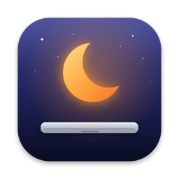
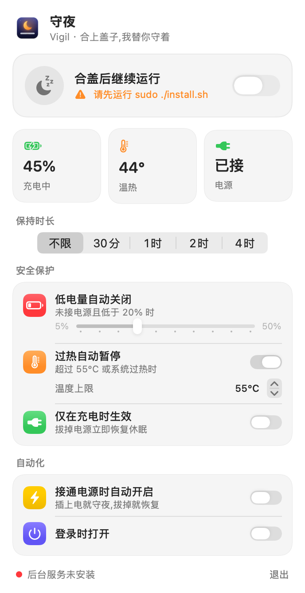
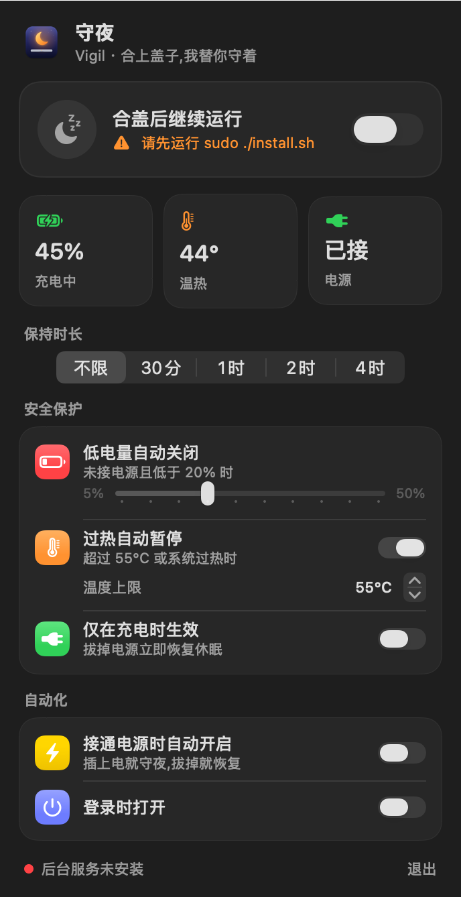

<p align="center">
  
</p>

<h1 align="center">守夜 Vigil</h1>

<p align="center">
  <b>合上盖子,我替你守着。</b><br>
  让 MacBook 合盖后继续运行的菜单栏小工具——带低电量保护和过热暂停,<br>
  专为让 Claude Code、Codex 这类 AI 编程助手通宵干活而做。
</p>

<p align="center">
  
  
  
  
</p>

<p align="center">
  
  &nbsp;&nbsp;
  
</p>

---

## 为什么需要它

macOS 合上盖子就会休眠,跑到一半的任务直接暂停。系统自带的 `caffeinate`、以及 KeepingYouAwake 这类工具**都拦不住合盖休眠**——合盖是硬件触发的,只有 `SleepDisabled` 这个系统标志位能压住它。

但直接开这个标志位很危险:电量耗尽强制关机、塞进包里闷到发烫,都没人管。

**守夜**把这件事做成了一个安全的开关。

## 功能

| | |
|---|---|
| 🌙 **合盖继续运行** | 无需外接显示器,电池供电也能用 |
| 🔋 **低电量自动关闭** | 未接电源且电量低于阈值(5%–50% 可调)时,自动恢复休眠 |
| 🌡️ **过热自动暂停** | 实时读取机身温度与系统热压力,超限暂停,降温 5°C 后自动恢复 |
| ⏱️ **定时关闭** | 30 分钟 / 1 / 2 / 4 小时,面板上显示倒计时 |
| 🔌 **仅充电时生效** | 拔掉电源立即恢复休眠 |
| ⚡ **插电自动开启** | 插上电就守夜,拔掉就恢复 |
| 🚪 **无人登录时恢复** | 注销后自动恢复正常休眠,不会一直醒着 |
| 🇨🇳 **中文原生界面** | SwiftUI 编写,自动适配浅色 / 深色模式 |

## 安装

需要 macOS 14+ 与 Xcode Command Line Tools(`xcode-select --install`),不需要完整 Xcode。

```bash
git clone https://github.com/mqm08/vigil-lid-awake.git
cd vigil-lid-awake
sudo ./install.sh
```

**这是唯一需要输入密码的一步。** 装好后菜单栏会出现 🌙 图标,之后所有操作都在面板里完成,不再需要密码。

## 卸载

```bash
sudo ./uninstall.sh
```

会移除应用、后台服务和配置文件,并把休眠行为恢复为系统默认。

## 工作原理

```
┌─────────────────────┐   写入意图(无需权限)    ┌──────────────────────────┐
│  Vigil.app          │ ───────────────────────▶ │ ~/.config/vigil/         │
│  菜单栏面板 (用户)   │                          │   config.json            │
└─────────────────────┘                          └────────────┬─────────────┘
          ▲                                                   │ 每 30 秒读取
          │ 读取状态                                           ▼
┌─────────┴───────────┐                          ┌──────────────────────────┐
│ /var/run/           │ ◀─────────────────────── │  vigild  (root, launchd) │
│   vigil.state.json  │        写入状态           │  电量/温度检查 → pmset    │
└─────────────────────┘                          └──────────────────────────┘
```

- **界面进程**以普通用户身份运行,只负责展示和写配置,**从不调用 `pmset`**。
- **守护进程** `vigild` 由 launchd 以 root 身份每 30 秒唤起一次,是唯一修改系统休眠设置的组件。它读取你的意图,叠加所有安全检查后,再决定是否设置 `SleepDisabled`。
- 温度数据来自 IORegistry 中的 `AppleSmartBattery` 与 `NSProcessInfo.thermalState`,均为系统自带接口,零第三方依赖。
- 界面意外退出时,守护进程会在下一次检查中按配置继续执行;点击「退出」会同时关闭守夜。

> **为什么不用 `SMAppService` 注册特权助手?** 在部分 macOS 版本上,它的注册流程会静默失败且不弹出授权窗口。经典的 LaunchDaemon 方式行为可预期、容易排查,卸载也彻底。

## 安全说明

- 守护进程只执行 `pmset -a disablesleep 0|1`,不做其他任何特权操作,源码仅约 150 行,可在 [`daemon/`](daemon) 中审阅。
- 任何以你身份运行的程序都能修改配置文件来开启守夜。最坏的结果是「该休眠时没休眠」,不涉及数据或权限风险。
- 重启电脑、卸载应用,都会让休眠行为回到系统默认。
- 合盖高负载运行会发热。即使有过热保护,也**请放在通风处,不要装进包里**。

## 日志

```bash
tail -f /var/log/vigil.log
```

## 从源码构建

```bash
./build.sh          # 产物: build/Vigil.app
```

项目结构:

```
App/Sources/        SwiftUI 菜单栏应用
daemon/             root 守护进程 (Python, 使用系统自带 /usr/bin/python3)
scripts/            图标渲染、截图生成
install.sh          安装
uninstall.sh        卸载
```

## 致谢

灵感来自 [Lidless](https://github.com/nghialuong/Lidless)、[Sleepless](https://github.com/Aboudjem/Sleepless) 与 [Amphetamine](https://apps.apple.com/app/amphetamine/id937984704)。

## License

[MIT](LICENSE)
